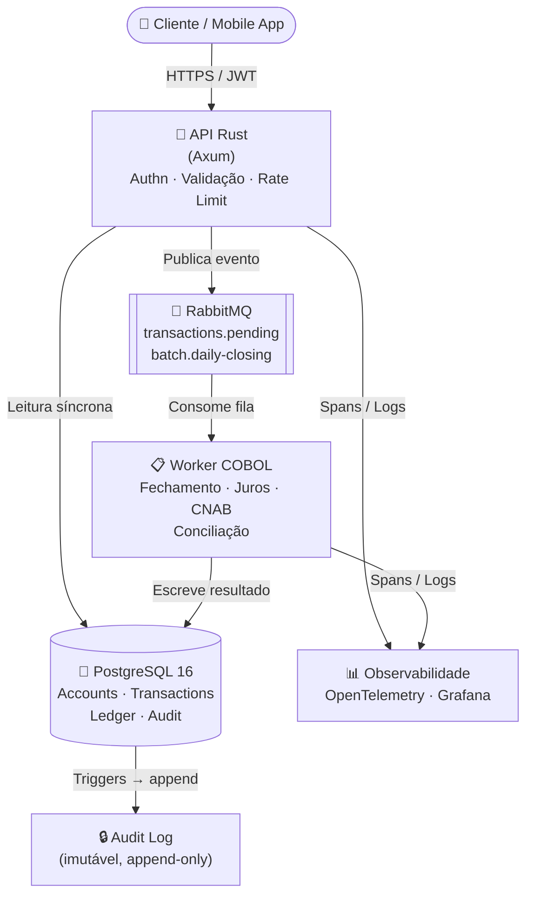
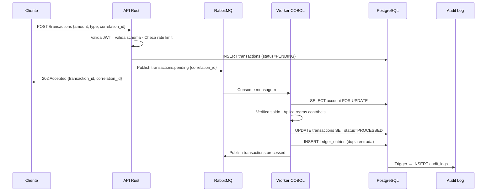

```
███████╗██╗   ██╗███████╗████████╗███████╗███╗   ███╗    ██████╗  █████╗ ███╗   ██╗██╗  ██╗
██╔════╝╚██╗ ██╔╝██╔════╝╚══██╔══╝██╔════╝████╗ ████║    ██╔══██╗██╔══██╗████╗  ██║██║ ██╔╝
███████╗ ╚████╔╝ ███████╗   ██║   █████╗  ██╔████╔██║    ██████╔╝███████║██╔██╗ ██║█████╔╝
╚════██║  ╚██╔╝  ╚════██║   ██║   ██╔══╝  ██║╚██╔╝██║    ██╔══██╗██╔══██║██║╚██╗██║██╔═██╗
███████║   ██║   ███████║   ██║   ███████╗██║ ╚═╝ ██║    ██████╔╝██║  ██║██║ ╚████║██║  ██╗
╚══════╝   ╚═╝   ╚══════╝   ╚═╝   ╚══════╝╚═╝     ╚═╝    ╚═════╝ ╚═╝  ╚═╝╚═╝  ╚═══╝╚═╝  ╚═╝
```

# System Bank


> Simulação de core banking que une processamento transacional legado (COBOL) a serviços de alta performance em Rust, com foco em consistência contábil, auditoria imutável e segurança de memória — refletindo a arquitetura híbrida real dos grandes bancos brasileiros.

---

## Sumário

1. [Arquitetura Geral](#arquitetura-geral)
2. [Modelagem de Dados](#modelagem-de-dados)
3. [Filas e Mensageria](#filas-e-mensageria)
4. [Por que COBOL?](#por-que-cobol)
5. [Por que Rust?](#por-que-rust)
6. [Segurança](#segurança)
7. [Estrutura do Monorepo](#estrutura-do-monorepo)
8. [Como Rodar Localmente](#como-rodar-localmente)
9. [Roadmap](#roadmap)

---

## Arquitetura Geral

O sistema é organizado em cinco camadas funcionalmente independentes, comunicando-se de forma assíncrona para garantir resiliência, consistência eventual e auditabilidade total.

| Camada | Tecnologia | Responsabilidade |
|---|---|---|
| **API** | Rust (Axum / Actix-web) | Autenticação, validação de entrada, roteamento, rate limiting |
| **Mensageria** | RabbitMQ | Desacoplamento síncrono/batch, retries, dead-letter |
| **Processamento Batch** | GnuCOBOL | Fechamento de caixa, cálculo de juros, CNAB, conciliação |
| **Persistência** | PostgreSQL 16 | Contas, transações, ledger, auditoria, jobs batch |
| **Observabilidade** | OpenTelemetry + Loki + Grafana | Logs estruturados (JSON), métricas, tracing distribuído |

### Diagrama de Fluxo



### Fluxo de uma Transação — Visão Detalhada



---

## Modelagem de Dados

### `accounts`

| Campo | Tipo | Descrição | Constraints |
|---|---|---|---|
| `id` | `UUID` | Identificador único da conta | `PK, NOT NULL` |
| `agency` | `VARCHAR(4)` | Código da agência | `NOT NULL` |
| `account_number` | `VARCHAR(10)` | Número da conta com dígito | `UNIQUE, NOT NULL` |
| `owner_id` | `UUID` | FK para tabela de usuários/clientes | `FK, NOT NULL` |
| `balance` | `NUMERIC(18,2)` | Saldo atual em reais | `NOT NULL, DEFAULT 0, CHECK >= 0` |
| `status` | `VARCHAR(20)` | `ACTIVE`, `BLOCKED`, `CLOSED` | `NOT NULL, DEFAULT 'ACTIVE'` |
| `created_at` | `TIMESTAMPTZ` | Data de abertura da conta | `NOT NULL, DEFAULT NOW()` |

> ⚠️ `balance` usa `NUMERIC(18,2)`, nunca `FLOAT` ou `DOUBLE PRECISION` — evita erros de arredondamento monetário.

---

### `transactions`

| Campo | Tipo | Descrição | Constraints |
|---|---|---|---|
| `id` | `UUID` | Identificador único da transação | `PK, NOT NULL` |
| `account_id` | `UUID` | Conta de origem | `FK → accounts.id, NOT NULL` |
| `destination_account_id` | `UUID` | Conta de destino (transferências) | `FK → accounts.id, NULLABLE` |
| `type` | `VARCHAR(20)` | `DEBIT`, `CREDIT`, `TRANSFER`, `FEE` | `NOT NULL` |
| `amount` | `NUMERIC(18,2)` | Valor da transação | `NOT NULL, CHECK > 0` |
| `status` | `VARCHAR(20)` | `PENDING`, `PROCESSED`, `FAILED`, `REVERSED` | `NOT NULL, DEFAULT 'PENDING'` |
| `correlation_id` | `UUID` | Chave de idempotência fornecida pelo cliente | `UNIQUE, NOT NULL` |
| `failure_reason` | `TEXT` | Motivo de falha (se aplicável) | `NULLABLE` |
| `created_at` | `TIMESTAMPTZ` | Timestamp de criação | `NOT NULL, DEFAULT NOW()` |
| `processed_at` | `TIMESTAMPTZ` | Timestamp de processamento pelo worker | `NULLABLE` |

---

### `ledger_entries`

> Implementa o princípio de **dupla entrada contábil**: cada transação gera exatamente dois registros — débito e crédito.

| Campo | Tipo | Descrição | Constraints |
|---|---|---|---|
| `id` | `UUID` | Identificador único da entrada | `PK, NOT NULL` |
| `transaction_id` | `UUID` | Transação que originou a entrada | `FK → transactions.id, NOT NULL` |
| `account_id` | `UUID` | Conta afetada | `FK → accounts.id, NOT NULL` |
| `entry_type` | `VARCHAR(10)` | `DEBIT` ou `CREDIT` | `NOT NULL` |
| `amount` | `NUMERIC(18,2)` | Valor da entrada | `NOT NULL, CHECK > 0` |
| `balance_after` | `NUMERIC(18,2)` | Saldo da conta imediatamente após a entrada | `NOT NULL` |
| `created_at` | `TIMESTAMPTZ` | Timestamp da entrada | `NOT NULL, DEFAULT NOW()` |

---

### `audit_logs`

> Tabela append-only. Nenhuma linha é jamais atualizada ou deletada. Alimentada por triggers PostgreSQL.

| Campo | Tipo | Descrição | Constraints |
|---|---|---|---|
| `id` | `BIGSERIAL` | Sequencial monotônico | `PK, NOT NULL` |
| `actor` | `UUID` | ID do usuário/sistema que executou a ação | `NOT NULL` |
| `action` | `VARCHAR(50)` | `CREATE_TRANSACTION`, `BLOCK_ACCOUNT`, `BATCH_CLOSE` | `NOT NULL` |
| `entity` | `VARCHAR(50)` | Nome da entidade afetada | `NOT NULL` |
| `entity_id` | `UUID` | ID do registro afetado | `NOT NULL` |
| `payload` | `JSONB` | Snapshot do estado anterior/posterior | `NULLABLE` |
| `ip_address` | `INET` | Endereço IP da requisição originadora | `NULLABLE` |
| `timestamp` | `TIMESTAMPTZ` | Momento exato da ação | `NOT NULL, DEFAULT NOW()` |

---

### `batch_jobs`

| Campo | Tipo | Descrição | Constraints |
|---|---|---|---|
| `id` | `UUID` | Identificador do job | `PK, NOT NULL` |
| `job_type` | `VARCHAR(50)` | `DAILY_CLOSING`, `INTEREST_CALC`, `CNAB_GENERATION`, `RECONCILIATION` | `NOT NULL` |
| `status` | `VARCHAR(20)` | `SCHEDULED`, `RUNNING`, `COMPLETED`, `FAILED` | `NOT NULL, DEFAULT 'SCHEDULED'` |
| `scheduled_for` | `TIMESTAMPTZ` | Data/hora planejada de execução | `NOT NULL` |
| `started_at` | `TIMESTAMPTZ` | Início efetivo | `NULLABLE` |
| `finished_at` | `TIMESTAMPTZ` | Término | `NULLABLE` |
| `records_processed` | `INTEGER` | Quantidade de registros processados | `NULLABLE, DEFAULT 0` |
| `error_message` | `TEXT` | Erro detalhado em caso de falha | `NULLABLE` |
| `triggered_by` | `VARCHAR(50)` | `SCHEDULER`, `MANUAL`, `EVENT` | `NOT NULL` |

---

## Filas e Mensageria

### Por que transações bancárias não são síncronas ponta a ponta?

Processar uma transação financeira de forma totalmente síncrona (requisição HTTP → banco → resposta) introduz riscos críticos:

- **Lock de conta:** `SELECT FOR UPDATE` mantém a linha bloqueada durante todo o processamento, criando gargalos sob concorrência
- **Indisponibilidade cascata:** se o worker de processamento cair, a transação é perdida sem possibilidade de retry
- **Sem idempotência nativa:** retentativas do cliente geram transações duplicadas
- **Timeout HTTP:** processamentos complexos (cálculo de juros compostos, validação de limites) ultrapassam janelas HTTP razoáveis

A fila quebra esse acoplamento: a API confirma **recebimento** (202 Accepted) e o worker processa de forma assíncrona com retries e controle de estado.

### Tópicos / Filas

| Fila | Produtor | Consumidor | Descrição |
|---|---|---|---|
| `transactions.pending` | API Rust | Worker COBOL | Novas transações aguardando processamento |
| `transactions.processed` | Worker COBOL | API Rust (webhook) | Resultado de transações concluídas |
| `transactions.failed` | Worker COBOL | DLQ Handler | Transações que excederam tentativas ou falharam por regra |
| `batch.daily-closing` | Scheduler (cron) | Worker COBOL | Dispara o job de fechamento diário |
| `transactions.dlq` | RabbitMQ (auto) | Equipe de operações / alertas | Dead-letter queue — mensagens que não puderam ser processadas |

### Estratégia de Idempotência

```
POST /transactions
  Body: { ..., correlation_id: "uuid-gerado-pelo-cliente" }
```

1. A API verifica se `correlation_id` já existe em `transactions` (índice único)
2. Se existir: retorna o estado atual da transação sem reprocessar (**idempotente**)
3. Se não existir: insere com `status=PENDING` e publica na fila
4. O worker valida o `correlation_id` novamente antes de aplicar qualquer alteração

### Dead-Letter Queue (DLQ)

- Mensagens que falham mais de **3 vezes** são movidas automaticamente para `transactions.dlq`
- Um consumer de alertas notifica a equipe via webhook
- O registro em `transactions` tem seu status atualizado para `FAILED` com `failure_reason` populado
- Permite reprocessamento manual após análise da causa raiz

---

## Por que COBOL?

Cerca de **70% do volume transacional bancário brasileiro** ainda transita por sistemas COBOL/mainframe. Itaú, Banco do Brasil, Caixa Econômica e Santander BR mantêm núcleos de processamento batch escritos em COBOL há décadas — não por inércia, mas por estabilidade comprovada sob carga de dezenas de milhões de transações diárias.

Este projeto simula o cenário real enfrentado por engenheiros de integração em grandes bancos: **expor funcionalidades legadas COBOL para consumo por microsserviços modernos**, sem reescrever o core banking.

### Responsabilidades do Módulo COBOL (`batch-cobol/`)

| Programa | Arquivo | Responsabilidade |
|---|---|---|
| `CLOSE001` | `DAILY-CLOSING.cbl` | Fechamento de caixa — consolidação de saldos do dia |
| `INTER001` | `INTEREST-CALC.cbl` | Cálculo de juros compostos sobre saldo devedor |
| `CNAB001` | `CNAB240-GEN.cbl` | Geração de arquivos CNAB 240 para compensação bancária |
| `RECON01` | `RECONCILIATION.cbl` | Conciliação diária entre `transactions` e `ledger_entries` |
| `FEE0001` | `FEE-CALC.cbl` | Cálculo de tarifas por tipo de operação |

O worker COBOL é invocado pelo consumer RabbitMQ (em Rust), que escreve arquivos de entrada formatados, executa o binário GnuCOBOL via `std::process::Command`, e lê o arquivo de saída para persistência no PostgreSQL.

---

## Por que Rust?

| Característica | Impacto em Sistema Bancário |
|---|---|
| **Segurança de memória sem GC** | Elimina buffer overflows e use-after-free sem pausas de coleta — crítico para latência previsível em processamento de transações |
| **Tipagem estrita** | `rust_decimal::Decimal` para valores monetários — nunca `f32`/`f64`, prevenindo erros de arredondamento que causam prejuízo real |
| **Concorrência segura** | O compilador previne data races em tempo de compilação — essencial para workers concorrentes acessando saldos de conta |
| **Performance** | Throughput comparável a C/C++ para validação de transações em tempo real, sem overhead de JVM ou interpretador |
| **`Result<T, E>` obrigatório** | Tratamento explícito de erros — impossível ignorar falhas silenciosamente como em exceções não verificadas |

### Tipos Monetários

```rust
use rust_decimal::Decimal;
use rust_decimal_macros::dec;

// CORRETO: sem perda de precisão
let amount: Decimal = dec!(1234.56);
let fee: Decimal = dec!(0.01) * amount;

// PROIBIDO: jamais usar f64 para dinheiro
// let amount: f64 = 1234.56; // ← erro de arredondamento garantido
```

---

## Segurança

### Autenticação e Autorização

| Mecanismo | Implementação |
|---|---|
| **Autenticação** | JWT com RS256 (assimétrico) — chave privada nunca sai do servidor de auth |
| **Expiração de token** | `access_token`: 15 minutos · `refresh_token`: 7 dias (rotação obrigatória) |
| **Autorização** | RBAC — perfis `CLIENT`, `OPERATOR`, `ADMIN` com escopos granulares |
| **Rate Limiting** | Por IP e por `account_id` — proteção contra força bruta e enumeração de contas |

### Criptografia

| Dado | Proteção |
|---|---|
| Senhas | Argon2id com salt único por usuário |
| Dados em trânsito | TLS 1.3 obrigatório — TLS 1.2 desabilitado |
| Dados em repouso | PostgreSQL com `pgcrypto` para campos sensíveis (CPF, número de conta) |
| Secrets em produção | Injetados via variáveis de ambiente — nunca em código ou `docker-compose.yml` |

### Princípios PCI-DSS Aplicados (simulação)

- **Requisito 3:** dados de titulares nunca armazenados em texto puro
- **Requisito 7:** controle de acesso por menor privilégio — cada serviço tem credencial própria de banco com permissões mínimas
- **Requisito 10:** logs de auditoria imutáveis com timestamp, IP e ação — retidos por 90 dias mínimo
- **Requisito 11:** dependências auditadas via `cargo audit` e `docker scout` no pipeline CI

### Logs de Auditoria Imutáveis

```sql
-- Trigger que previne UPDATE e DELETE na tabela audit_logs
CREATE OR REPLACE FUNCTION audit_logs_immutable()
RETURNS TRIGGER AS $$
BEGIN
  RAISE EXCEPTION 'audit_logs é append-only. Operação % não permitida.', TG_OP;
END;
$$ LANGUAGE plpgsql;

CREATE TRIGGER enforce_audit_immutability
BEFORE UPDATE OR DELETE ON audit_logs
FOR EACH ROW EXECUTE FUNCTION audit_logs_immutable();
```

---

## Estrutura do Monorepo

```
system-bank/
│
├── .gitignore
│
├── api-rust/                              # Camada de API (Rust + Axum)
│   ├── Cargo.toml
│   ├── Dockerfile                         # Multi-stage: rust:1.78 builder + debian-slim
│   └── src/
│       ├── main.rs                        # Boot: DB pool, AMQP channel, router
│       ├── errors.rs                      # AppError + AppResult
│       ├── config/
│       │   └── mod.rs                     # Config lida do ambiente (.env)
│       ├── middleware/
│       │   ├── mod.rs
│       │   └── auth.rs                    # JWT RS256 → injeta Claims no request
│       ├── models/
│       │   ├── mod.rs
│       │   ├── account.rs                 # Account, AccountStatus, CreateAccountRequest
│       │   └── transaction.rs             # Transaction, TransactionType/Status (Decimal)
│       ├── routes/
│       │   ├── mod.rs
│       │   ├── accounts.rs                # GET|POST /accounts, GET /accounts/:id
│       │   ├── transactions.rs            # POST /transactions (202), GET /transactions/:id
│       │   └── health.rs                  # GET /health
│       ├── services/
│       │   ├── mod.rs
│       │   ├── account_service.rs         # CRUD com escopo por owner_id
│       │   └── transaction_service.rs     # Idempotência via correlation_id + publish
│       └── queue/
│           ├── mod.rs
│           └── publisher.rs               # Declara filas + publica transactions.pending
│
├── batch-cobol/                           # Camada de processamento legado (GnuCOBOL 3.2)
│   ├── Makefile                           # Compila todos os .cbl para bin/
│   ├── Dockerfile                         # gnucobol builder + debian-slim runtime
│   ├── src/
│   │   ├── DAILY-CLOSING.cbl             # Fechamento de caixa — consolidação diária
│   │   ├── INTEREST-CALC.cbl            # Juros compostos (capitalização diária)
│   │   ├── CNAB240-GEN.cbl              # Arquivo CNAB 240 para compensação bancária
│   │   ├── RECONCILIATION.cbl           # Conciliação transactions × ledger_entries
│   │   └── FEE-CALC.cbl                 # Cálculo de tarifas por tipo de operação
│   ├── copybooks/
│   │   └── ACCOUNT-RECORD.cpy           # Estrutura de conta (COPY compartilhado)
│   └── io/
│       ├── input/                         # Gerados pelo worker Rust antes de invocar COBOL
│       └── output/                        # Lidos pelo worker Rust após execução do COBOL
│
├── migrations/                            # SQL versionado — aplicado via sqlx::migrate!
│   ├── 001_initial_schema.sql            # accounts + transactions + índices
│   ├── 002_ledger_entries.sql           # ledger_entries (dupla entrada contábil)
│   ├── 003_audit_triggers.sql           # audit_logs + trigger de imutabilidade + audit de status
│   └── 004_batch_jobs.sql               # batch_jobs (rastreamento de jobs COBOL)
│
├── infra/
│   ├── docker/
│   │   ├── docker-compose.yml            # postgres · rabbitmq · api · cobol-worker · loki · grafana
│   │   └── .env.example                  # Template de variáveis — nunca commitar .env real
│   ├── ci/
│   │   └── .github/
│   │       └── workflows/
│   │           ├── ci.yml                # fmt · clippy · cargo audit · tests · docker build
│   │           ├── staging.yml           # Push em develop → deploy automático
│   │           └── production.yml        # Tag v*.*.* → aprovação manual → deploy
│   ├── grafana/
│   │   └── dashboards/                   # JSON provisionados automaticamente
│   └── postgres/
│       └── init.sql                      # pgcrypto, uuid-ossp, configurações de dev
│
├── scripts/
│   └── run-job.sh                        # Wrapper: executa binário COBOL + atualiza batch_jobs
│
└── docs/
    ├── architecture/                      # Documentação técnica narrativa
    └── adr/                              # Architecture Decision Records
        ├── README.md                      # Índice de ADRs
        ├── 001-rust-over-java.md         # Por que Rust em vez de Java/Spring Boot
        ├── 002-rabbitmq-over-kafka.md    # Por que RabbitMQ em vez de Kafka
        └── 003-cobol-subprocess.md       # Por que subprocesso em vez de FFI
```

---

## Como Rodar Localmente

### Pré-requisitos

| Ferramenta | Versão mínima |
|---|---|
| Docker | 24.x |
| Docker Compose | v2.x |
| GnuCOBOL (opcional, para dev COBOL) | 3.2 |
| Rust (opcional, para dev API) | 1.78 |

### Stack Completa via Docker Compose

```bash
# 1. Clone o repositório
git clone https://github.com/caio-daniel-souza/system-bank.git
cd system-bank

# 2. Configure variáveis de ambiente
cp infra/docker/.env.example infra/docker/.env
# Edite .env com suas configs locais (senhas, portas, etc.)

# 3. Suba todos os serviços
docker compose -f infra/docker/docker-compose.yml up -d

# 4. Aguarde os serviços ficarem healthy (~30s)
docker compose -f infra/docker/docker-compose.yml ps

# 5. Execute as migrations
docker compose -f infra/docker/docker-compose.yml exec api \
  ./scripts/run-migrations.sh
```

### Serviços e Portas

| Serviço | Porta Local | Descrição |
|---|---|---|
| `api-rust` | `8080` | API REST + OpenAPI em `/docs` |
| `postgres` | `5432` | Banco principal |
| `rabbitmq` | `5672` / `15672` | Broker de mensagens / Management UI |
| `grafana` | `3000` | Dashboards de observabilidade |
| `loki` | `3100` | Agregação de logs |

### Testar a API

```bash
# Health check
curl http://localhost:8080/health

# Criar conta (exemplo)
curl -X POST http://localhost:8080/accounts \
  -H "Authorization: Bearer <token>" \
  -H "Content-Type: application/json" \
  -d '{"owner_id": "uuid", "agency": "0001"}'

# Criar transação com idempotência
curl -X POST http://localhost:8080/transactions \
  -H "Authorization: Bearer <token>" \
  -H "Content-Type: application/json" \
  -d '{
    "account_id": "uuid",
    "type": "DEBIT",
    "amount": "150.00",
    "correlation_id": "uuid-unico-gerado-pelo-cliente"
  }'
```

### Executar Job COBOL Manualmente

```bash
# Acessa o container COBOL
docker compose exec cobol-worker bash

# Executa fechamento diário manualmente
./run-job.sh DAILY-CLOSING 2024-01-15
```

---

## Roadmap

| Status | Feature | Descrição |
|---|---|---|
| ✅ | Core schema + migrations | Modelagem completa com triggers de auditoria |
| ✅ | API Rust — CRUD de contas | Endpoints autenticados com rate limiting |
| ✅ | Integração RabbitMQ | Publicação/consumo de transações assíncronas |
| ✅ | Worker COBOL — fechamento diário | `DAILY-CLOSING.cbl` integrado ao pipeline |
| 🔄 | Geração de CNAB 240 | Arquivo padrão de compensação bancária |
| 🔄 | Cálculo de juros compostos | `INTEREST-CALC.cbl` com regime de capitalização |
| 📋 | PIX simulado | Fluxo end-to-end com chave, alias e QR Code |
| 📋 | Open Finance (OFX/OBK) | Exportação de extratos em formato Open Banking |
| 📋 | Relatórios regulatórios BACEN | SCR, PSTAW10, DOC 3040 simulados |
| 📋 | TLS mútuo (mTLS) | Autenticação bidirecional entre serviços internos |
| 📋 | Chaos Engineering | Testes de resiliência com falhas injetadas |
| 📋 | Dashboard de reconciliação | UI para operadores visualizarem divergências batch |

---

## Licença

MIT © [Caio Daniel Souza](https://github.com/caio-daniel-souza)

---

<p align="center">
  Construído com 🦀 Rust · 📋 COBOL · 🐘 PostgreSQL · 🐇 RabbitMQ
</p>
