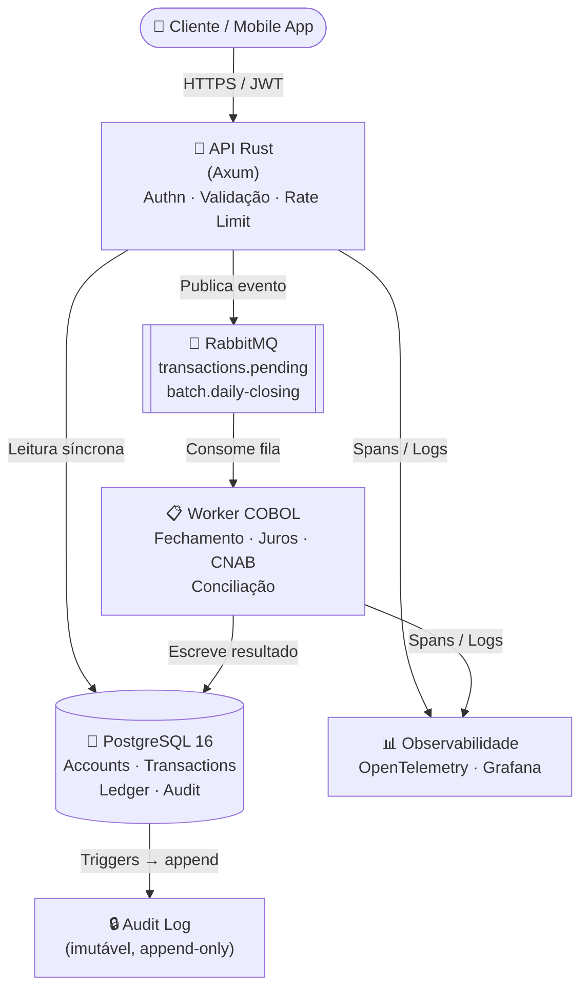
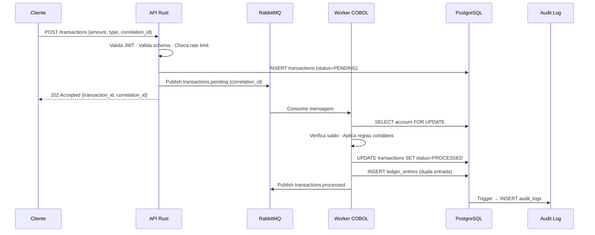

```
███████╗██╗   ██╗███████╗████████╗███████╗███╗   ███╗    ██████╗  █████╗ ███╗   ██╗██╗  ██╗
██╔════╝╚██╗ ██╔╝██╔════╝╚══██╔══╝██╔════╝████╗ ████║    ██╔══██╗██╔══██╗████╗  ██║██║ ██╔╝
███████╗ ╚████╔╝ ███████╗   ██║   █████╗  ██╔████╔██║    ██████╔╝███████║██╔██╗ ██║█████╔╝
╚════██║  ╚██╔╝  ╚════██║   ██║   ██╔══╝  ██║╚██╔╝██║    ██╔══██╗██╔══██║██║╚██╗██║██╔═██╗
███████║   ██║   ███████║   ██║   ███████╗██║ ╚═╝ ██║    ██████╔╝██║  ██║██║ ╚████║██║  ██╗
╚══════╝   ╚═╝   ╚══════╝   ╚═╝   ╚══════╝╚═╝     ╚═╝    ╚═════╝ ╚═╝  ╚═╝╚═╝  ╚═══╝╚═╝  ╚═╝
```

# System-Bank


---

## O que é o System-Bank?

O **System-Bank** é uma **simulação de core banking** — o núcleo de um sistema bancário — construída para demonstrar como os grandes bancos brasileiros (Itaú, Banco do Brasil, Caixa Econômica) operam por dentro.

Na prática, você terá um sistema capaz de:

- 🏦 **Abrir e gerenciar contas bancárias** com agência, número e dígito verificador gerado automaticamente
- 💸 **Processar transações** (débito, crédito, transferência, tarifas) de forma assíncrona e idempotente
- 🔑 **Pagar e receber via PIX** com registro de chaves CPF, e-mail, telefone ou aleatória, e geração de QR Code
- 📄 **Gerar extratos** em JSON ou no formato bancário **OFX** (padrão Open Finance/Open Banking)
- 🔒 **Autenticar usuários** com JWT RS256 (assinatura assimétrica) e controlar acesso por perfil (CLIENT, OPERATOR, ADMIN)
- 📋 **Executar jobs de fechamento de caixa e conciliação** via módulos COBOL legados — simulando a realidade dos mainframes bancários
- 🛡️ **Auditar toda e qualquer ação** num log imutável (append-only) protegido por triggers no banco de dados
- 📊 **Observar o sistema em produção** com rastreamento distribuído (OpenTelemetry), logs estruturados (Loki) e dashboards (Grafana)

### Por que isso é relevante?

Cerca de **70% do volume transacional bancário brasileiro** ainda transita por sistemas COBOL/mainframe. Este projeto simula o cenário real que engenheiros de bancos enfrentam todo dia: **fazer um serviço moderno em Rust se comunicar com processamento legado em COBOL**, sem jogar fora décadas de código testado e auditado.

---

## Arquitetura Geral

O sistema é organizado em cinco camadas que se comunicam de forma assíncrona, garantindo resiliência, consistência eventual e auditabilidade total.

| Camada | Tecnologia | Responsabilidade |
|---|---|---|
| **API** | Rust (Axum) | Autenticação JWT, validação de entrada, roteamento, rate limiting |
| **Mensageria** | RabbitMQ | Desacoplamento síncrono/batch, retries automáticos, dead-letter |
| **Processamento Batch** | GnuCOBOL | Fechamento de caixa, cálculo de juros, CNAB, conciliação |
| **Persistência** | PostgreSQL 16 | Contas, transações, ledger, auditoria, jobs batch |
| **Observabilidade** | OpenTelemetry + Loki + Grafana | Logs estruturados JSON, métricas, tracing distribuído |

### Diagrama de Fluxo


```mermaid
flowchart TD
    Client(["👤 Cliente / Mobile App"])
    API["🦀 API Rust\n(Axum)\nAuthn · Validação · Rate Limit"]
    MQ[["🐇 RabbitMQ\ntransactions.pending\nbatch.daily-closing"]]
    Worker["📋 Worker COBOL\nFechamento · Juros · CNAB\nConciliação"]
    DB[("🐘 PostgreSQL 16\nAccounts · Transactions\nLedger · Audit")]
    Audit["🔒 Audit Log\n(imutável, append-only)"]
    Obs["📊 Observabilidade\nOpenTelemetry · Grafana"]

    Client -->|"HTTPS / JWT"| API
    API -->|"Publica evento"| MQ
    API -->|"Leitura síncrona"| DB
    MQ -->|"Consome fila"| Worker
    Worker -->|"Escreve resultado"| DB
    DB -->|"Triggers → append"| Audit
    API & Worker -->|"Spans / Logs"| Obs
```

### Fluxo de uma Transação — Visão Detalhada


```mermaid
sequenceDiagram
    participant C as Cliente
    participant A as API Rust
    participant Q as RabbitMQ
    participant W as Worker COBOL
    participant DB as PostgreSQL
    participant AL as Audit Log

    C->>A: POST /transactions {amount, type, correlation_id}
    A->>A: Valida JWT · Valida schema · Checa rate limit
    A->>DB: INSERT transactions (status=PENDING)
    A->>Q: Publish transactions.pending {correlation_id}
    A-->>C: 202 Accepted {transaction_id, correlation_id}

    Q->>W: Consome mensagem
    W->>DB: SELECT account FOR UPDATE
    W->>W: Verifica saldo · Aplica regras contábeis
    W->>DB: UPDATE transactions SET status=PROCESSED
    W->>DB: INSERT ledger_entries (dupla entrada)
    W->>Q: Publish transactions.processed
    DB->>AL: Trigger → INSERT audit_logs
```

---

## Modelagem de Dados

### `accounts`

| Campo | Tipo | Descrição | Constraints |
|---|---|---|---|
| `id` | `UUID` | Identificador único da conta | `PK, NOT NULL` |
| `agency` | `VARCHAR(4)` | Código da agência | `NOT NULL` |
| `account_number` | `VARCHAR(10)` | Número da conta com dígito | `UNIQUE, NOT NULL` |
| `owner_id` | `UUID` | FK para tabela de usuários/clientes | `FK, NOT NULL` |
| `balance` | `NUMERIC(18,2)` | Saldo atual em reais | `NOT NULL, DEFAULT 0, CHECK >= 0` |
| `status` | `VARCHAR(20)` | `ACTIVE`, `BLOCKED`, `CLOSED` | `NOT NULL, DEFAULT 'ACTIVE'` |
| `created_at` | `TIMESTAMPTZ` | Data de abertura da conta | `NOT NULL, DEFAULT NOW()` |

> ⚠️ `balance` usa `NUMERIC(18,2)`, nunca `FLOAT` ou `DOUBLE PRECISION` — evita erros de arredondamento monetário.

---

### `transactions`

| Campo | Tipo | Descrição | Constraints |
|---|---|---|---|
| `id` | `UUID` | Identificador único da transação | `PK, NOT NULL` |
| `account_id` | `UUID` | Conta de origem | `FK → accounts.id, NOT NULL` |
| `destination_account_id` | `UUID` | Conta de destino (transferências) | `FK → accounts.id, NULLABLE` |
| `type` | `VARCHAR(20)` | `DEBIT`, `CREDIT`, `TRANSFER`, `FEE` | `NOT NULL` |
| `amount` | `NUMERIC(18,2)` | Valor da transação | `NOT NULL, CHECK > 0` |
| `status` | `VARCHAR(20)` | `PENDING`, `PROCESSED`, `FAILED`, `REVERSED` | `NOT NULL, DEFAULT 'PENDING'` |
| `correlation_id` | `UUID` | Chave de idempotência fornecida pelo cliente | `UNIQUE, NOT NULL` |
| `failure_reason` | `TEXT` | Motivo de falha (se aplicável) | `NULLABLE` |
| `created_at` | `TIMESTAMPTZ` | Timestamp de criação | `NOT NULL, DEFAULT NOW()` |
| `processed_at` | `TIMESTAMPTZ` | Timestamp de processamento pelo worker | `NULLABLE` |

---

### `ledger_entries`

> Implementa o princípio de **dupla entrada contábil**: cada transação gera exatamente dois registros — débito e crédito.

| Campo | Tipo | Descrição | Constraints |
|---|---|---|---|
| `id` | `UUID` | Identificador único da entrada | `PK, NOT NULL` |
| `transaction_id` | `UUID` | Transação que originou a entrada | `FK → transactions.id, NOT NULL` |
| `account_id` | `UUID` | Conta afetada | `FK → accounts.id, NOT NULL` |
| `entry_type` | `VARCHAR(10)` | `DEBIT` ou `CREDIT` | `NOT NULL` |
| `amount` | `NUMERIC(18,2)` | Valor da entrada | `NOT NULL, CHECK > 0` |
| `balance_after` | `NUMERIC(18,2)` | Saldo da conta imediatamente após a entrada | `NOT NULL` |
| `created_at` | `TIMESTAMPTZ` | Timestamp da entrada | `NOT NULL, DEFAULT NOW()` |

---

### `audit_logs`

> Tabela append-only. Nenhuma linha é jamais atualizada ou deletada. Alimentada por triggers PostgreSQL.

| Campo | Tipo | Descrição | Constraints |
|---|---|---|---|
| `id` | `BIGSERIAL` | Sequencial monotônico | `PK, NOT NULL` |
| `actor` | `UUID` | ID do usuário/sistema que executou a ação | `NOT NULL` |
| `action` | `VARCHAR(50)` | `CREATE_TRANSACTION`, `BLOCK_ACCOUNT`, `BATCH_CLOSE` | `NOT NULL` |
| `entity` | `VARCHAR(50)` | Nome da entidade afetada | `NOT NULL` |
| `entity_id` | `UUID` | ID do registro afetado | `NOT NULL` |
| `payload` | `JSONB` | Snapshot do estado anterior/posterior | `NULLABLE` |
| `ip_address` | `INET` | Endereço IP da requisição originadora | `NULLABLE` |
| `timestamp` | `TIMESTAMPTZ` | Momento exato da ação | `NOT NULL, DEFAULT NOW()` |

---

### `batch_jobs`

| Campo | Tipo | Descrição | Constraints |
|---|---|---|---|
| `id` | `UUID` | Identificador do job | `PK, NOT NULL` |
| `job_type` | `VARCHAR(50)` | `DAILY_CLOSING`, `INTEREST_CALC`, `CNAB_GENERATION`, `RECONCILIATION`, `FEE_CALC` | `NOT NULL` |
| `status` | `VARCHAR(20)` | `SCHEDULED`, `RUNNING`, `COMPLETED`, `FAILED` | `NOT NULL, DEFAULT 'SCHEDULED'` |
| `scheduled_for` | `TIMESTAMPTZ` | Data/hora planejada de execução | `NOT NULL` |
| `started_at` | `TIMESTAMPTZ` | Início efetivo | `NULLABLE` |
| `finished_at` | `TIMESTAMPTZ` | Término | `NULLABLE` |
| `records_processed` | `INTEGER` | Quantidade de registros processados | `NULLABLE, DEFAULT 0` |
| `error_message` | `TEXT` | Erro detalhado em caso de falha | `NULLABLE` |
| `triggered_by` | `VARCHAR(50)` | `SCHEDULER`, `MANUAL`, `EVENT` | `NOT NULL` |

---

## Filas e Mensageria

### Por que transações bancárias não são síncronas ponta a ponta?

Processar uma transação financeira de forma totalmente síncrona (requisição HTTP → banco → resposta) introduz riscos críticos:

- **Lock de conta:** `SELECT FOR UPDATE` mantém a linha bloqueada durante todo o processamento, criando gargalos sob concorrência
- **Indisponibilidade cascata:** se o worker de processamento cair, a transação é perdida sem possibilidade de retry
- **Sem idempotência nativa:** retentativas do cliente geram transações duplicadas
- **Timeout HTTP:** processamentos complexos (cálculo de juros compostos, validação de limites) ultrapassam janelas HTTP razoáveis

A fila quebra esse acoplamento: a API confirma **recebimento** (202 Accepted) e o worker processa de forma assíncrona com retries e controle de estado.

### Tópicos / Filas

| Fila | Produtor | Consumidor | Descrição |
|---|---|---|---|
| `transactions.pending` | API Rust | Worker COBOL | Novas transações aguardando processamento |
| `transactions.processed` | Worker COBOL | API Rust (webhook) | Resultado de transações concluídas |
| `transactions.failed` | Worker COBOL | DLQ Handler | Transações que excederam tentativas ou falharam por regra |
| `batch.daily-closing` | Scheduler (cron) | Worker COBOL | Dispara o job de fechamento diário |
| `transactions.dlq` | RabbitMQ (auto) | Equipe de operações / alertas | Dead-letter queue — mensagens que não puderam ser processadas |

### Estratégia de Idempotência

```
POST /transactions
  Body: { ..., correlation_id: "uuid-gerado-pelo-cliente" }
```

1. A API verifica se `correlation_id` já existe em `transactions` (índice único)
2. Se existir: retorna o estado atual da transação sem reprocessar (**idempotente**)
3. Se não existir: insere com `status=PENDING` e publica na fila
4. O worker valida o `correlation_id` novamente antes de aplicar qualquer alteração

### Dead-Letter Queue (DLQ)

- Mensagens que falham mais de **3 vezes** são movidas automaticamente para `transactions.dlq`
- Um consumer de alertas notifica a equipe via webhook
- O registro em `transactions` tem seu status atualizado para `FAILED` com `failure_reason` populado
- Permite reprocessamento manual após análise da causa raiz

---

## Por que COBOL?

Cerca de **70% do volume transacional bancário brasileiro** ainda transita por sistemas COBOL/mainframe. Itaú, Banco do Brasil, Caixa Econômica e Santander BR mantêm núcleos de processamento batch escritos em COBOL há décadas — não por inércia, mas por estabilidade comprovada sob carga de dezenas de milhões de transações diárias.

Este projeto simula o cenário real enfrentado por engenheiros de integração em grandes bancos: **expor funcionalidades legadas COBOL para consumo por microsserviços modernos**, sem reescrever o core banking.

### Responsabilidades do Módulo COBOL (`batch-cobol/`)

| Programa | Arquivo | Responsabilidade |
|---|---|---|
| `CLOSE001` | `DAILY-CLOSING.cbl` | Fechamento de caixa — consolidação de saldos do dia |
| `INTER001` | `INTEREST-CALC.cbl` | Cálculo de juros compostos sobre saldo devedor |
| `CNAB001` | `CNAB240-GEN.cbl` | Geração de arquivos CNAB 240 para compensação bancária |
| `RECON01` | `RECONCILIATION.cbl` | Conciliação diária entre `transactions` e `ledger_entries` |
| `FEE0001` | `FEE-CALC.cbl` | Cálculo de tarifas por tipo de operação |

O worker COBOL é invocado pelo consumer RabbitMQ (em Rust), que escreve arquivos de entrada formatados, executa o binário GnuCOBOL via `std::process::Command`, e lê o arquivo de saída para persistência no PostgreSQL.

---

## Por que Rust?

| Característica | Impacto em Sistema Bancário |
|---|---|
| **Segurança de memória sem GC** | Elimina buffer overflows e use-after-free sem pausas de coleta — crítico para latência previsível em processamento de transações |
| **Tipagem estrita** | `rust_decimal::Decimal` para valores monetários — nunca `f32`/`f64`, prevenindo erros de arredondamento que causam prejuízo real |
| **Concorrência segura** | O compilador previne data races em tempo de compilação — essencial para workers concorrentes acessando saldos de conta |
| **Performance** | Throughput comparável a C/C++ para validação de transações em tempo real, sem overhead de JVM ou interpretador |
| **`Result<T, E>` obrigatório** | Tratamento explícito de erros — impossível ignorar falhas silenciosamente como em exceções não verificadas |

### Tipos Monetários

```rust
use rust_decimal::Decimal;
use rust_decimal_macros::dec;

// CORRETO: sem perda de precisão
let amount: Decimal = dec!(1234.56);
let fee: Decimal = dec!(0.01) * amount;

// PROIBIDO: jamais usar f64 para dinheiro
// let amount: f64 = 1234.56; // ← erro de arredondamento garantido
```

---

## Segurança

### Autenticação e Autorização

| Mecanismo | Implementação |
|---|---|
| **Autenticação** | JWT com RS256 (assimétrico) — chave privada nunca sai do servidor de auth |
| **Expiração de token** | `access_token`: 15 minutos · `refresh_token`: 7 dias (rotação obrigatória) |
| **Autorização** | RBAC — perfis `CLIENT`, `OPERATOR`, `ADMIN` com escopos granulares |
| **Rate Limiting** | Por IP e por `account_id` — proteção contra força bruta e enumeração de contas |

### Criptografia

| Dado | Proteção |
|---|---|
| Senhas | Argon2id com salt único por usuário |
| Dados em trânsito | TLS 1.3 obrigatório — TLS 1.2 desabilitado |
| Dados em repouso | PostgreSQL com `pgcrypto` para campos sensíveis (CPF, número de conta) |
| Secrets em produção | Injetados via variáveis de ambiente — nunca em código ou `docker-compose.yml` |

### Princípios PCI-DSS Aplicados (simulação)

- **Requisito 3:** dados de titulares nunca armazenados em texto puro
- **Requisito 7:** controle de acesso por menor privilégio — cada serviço tem credencial própria de banco com permissões mínimas
- **Requisito 10:** logs de auditoria imutáveis com timestamp, IP e ação — retidos por 90 dias mínimo
- **Requisito 11:** dependências auditadas via `cargo audit` e `docker scout` no pipeline CI

### Logs de Auditoria Imutáveis

```sql
-- Trigger que previne UPDATE e DELETE na tabela audit_logs
CREATE OR REPLACE FUNCTION audit_logs_immutable()
RETURNS TRIGGER AS $$
BEGIN
  RAISE EXCEPTION 'audit_logs é append-only. Operação % não permitida.', TG_OP;
END;
$$ LANGUAGE plpgsql;

CREATE TRIGGER enforce_audit_immutability
BEFORE UPDATE OR DELETE ON audit_logs
FOR EACH ROW EXECUTE FUNCTION audit_logs_immutable();
```

---

## Estrutura do Monorepo

```
system-bank/
│
├── api-rust/                              # Camada de API (Rust + Axum)
│   ├── Cargo.toml
│   ├── Dockerfile                         # Multi-stage: rust:1.78 builder + debian-slim
│   └── src/
│       ├── main.rs                        # Boot: DB pool, AMQP channel, router
│       ├── lib.rs                         # Módulos públicos e AppState
│       ├── app.rs                         # Montagem do router com middlewares
│       ├── errors.rs                      # AppError + AppResult (BadRequest, NotFound, etc.)
│       ├── telemetry.rs                   # OpenTelemetry OTLP + tracing-subscriber
│       ├── tls.rs                         # mTLS via rustls (certificados em base64 no env)
│       ├── middleware/
│       │   ├── auth.rs                    # JWT RS256 → injeta Claims no request
│       │   ├── rate_limit.rs              # Token bucket por IP e por account_id
│       │   └── tracing.rs                 # Span HTTP com propagação W3C traceparent
│       ├── models/
│       │   ├── account.rs                 # Account, AccountStatus, CreateAccountRequest
│       │   ├── transaction.rs             # Transaction, TransactionType/Status (Decimal)
│       │   ├── pix.rs                     # PixKey, PixPaymentRequest, PixQrResponse
│       │   └── statement.rs              # StatementQuery, StatementFormat (JSON/OFX)
│       ├── routes/
│       │   ├── accounts.rs                # GET|POST /accounts, GET /:id, GET /:id/statement
│       │   ├── transactions.rs            # POST / (202 Accepted), GET /:id
│       │   ├── pix.rs                     # POST /keys, GET /keys, DELETE /keys/:id, POST /payment
│       │   ├── internal.rs               # POST /jobs/callback (uso interno — sem auth)
│       │   └── health.rs                  # GET /health
│       ├── services/
│       │   ├── account_service.rs         # CRUD com escopo por owner_id
│       │   ├── transaction_service.rs     # Idempotência via correlation_id + publish
│       │   └── pix_service.rs            # Registro de chaves, pagamento, QR Code
│       ├── queue/
│       │   ├── publisher.rs              # Declara filas + publica transactions.pending
│       │   └── consumer.rs               # Consome transactions.processed com retry + DLQ
│       └── bin/
│           └── worker.rs                  # Binary separado: orquestra jobs COBOL
│
├── batch-cobol/                           # Camada de processamento legado (GnuCOBOL 3.2)
│   ├── Makefile                           # Compila todos os .cbl para bin/
│   ├── Dockerfile                         # gnucobol builder + debian-slim runtime
│   └── src/
│       ├── DAILY-CLOSING.cbl             # Fechamento de caixa — consolidação diária
│       ├── INTEREST-CALC.cbl            # Juros compostos (capitalização diária)
│       ├── CNAB240-GEN.cbl              # Arquivo CNAB 240 para compensação bancária
│       ├── RECONCILIATION.cbl           # Conciliação transactions × ledger_entries
│       └── FEE-CALC.cbl                 # Cálculo de tarifas por tipo de operação
│
├── migrations/                            # SQL versionado — aplicado sequencialmente
│   ├── 001_initial_schema.sql            # accounts + transactions + índices
│   ├── 002_ledger_entries.sql           # ledger_entries (dupla entrada contábil)
│   ├── 003_audit_triggers.sql           # audit_logs + trigger de imutabilidade
│   ├── 004_batch_jobs.sql               # batch_jobs (rastreamento de jobs COBOL)
│   ├── 005_pix_keys.sql                 # pix_keys (chaves PIX por conta)
│   └── 006_users.sql                    # users + FK em accounts
│
├── infra/docker/
│   ├── docker-compose.yml               # postgres · rabbitmq · api · cobol · loki · grafana · tempo · otel
│   ├── .env.example                      # Template de variáveis — nunca commitar .env real
│   └── grafana/                          # Dashboards e datasources provisionados automaticamente
│
├── scripts/
│   ├── run-migrations.sh                 # Aplica migrations ordenadas via psql
│   ├── run-job.sh                        # Wrapper: executa job COBOL + atualiza batch_jobs
│   └── generate-certs.sh                # Gera CA, servidor e cliente para mTLS
│
└── docs/
    ├── architecture/                      # Documentação técnica narrativa
    └── adr/                              # Architecture Decision Records
        ├── 001-rust-over-java.md         # Por que Rust em vez de Java/Spring Boot
        ├── 002-rabbitmq-over-kafka.md    # Por que RabbitMQ em vez de Kafka
        └── 003-cobol-subprocess.md       # Por que subprocesso em vez de FFI
```

---

## Como Rodar Localmente

### Pré-requisitos

| Ferramenta | Versão mínima |
|---|---|
| Docker | 24.x |
| Docker Compose | v2.x |
| GnuCOBOL (opcional, para dev COBOL) | 3.2 |
| Rust (opcional, para dev API) | 1.78 |

### Stack Completa via Docker Compose

```bash
# 1. Clone o repositório
git clone https://github.com/CaioSouzx00/System-Bank.git
cd System-Bank

# 2. Configure variáveis de ambiente
cp infra/docker/.env.example infra/docker/.env
# Edite .env com suas configs locais (senhas, JWT_PUBLIC_KEY, etc.)

# 3. Suba todos os serviços
docker compose -f infra/docker/docker-compose.yml up -d

# 4. Aguarde os serviços ficarem healthy (~30s)
docker compose -f infra/docker/docker-compose.yml ps

# 5. Execute as migrations
bash scripts/run-migrations.sh
```

### Serviços e Portas

| Serviço | Porta Local | Descrição |
|---|---|---|
| `api-rust` | `8080` | API REST principal |
| `postgres` | `5432` | Banco de dados principal |
| `rabbitmq` | `5672` / `15672` | Broker de mensagens / Management UI |
| `grafana` | `3000` | Dashboards de observabilidade |
| `loki` | `3100` | Agregação de logs |
| `tempo` | `3200` | Backend de traces |
| `otel-collector` | `4317` / `4318` | Collector OpenTelemetry |

### Testar a API

```bash
# Health check
curl http://localhost:8080/health

# Criar conta
curl -X POST http://localhost:8080/accounts \
  -H "Authorization: Bearer <token>" \
  -H "Content-Type: application/json" \
  -d '{"agency": "0001"}'

# Criar transação com idempotência
curl -X POST http://localhost:8080/transactions \
  -H "Authorization: Bearer <token>" \
  -H "Content-Type: application/json" \
  -d '{
    "account_id": "<uuid-da-conta>",
    "type": "DEBIT",
    "amount": "150.00",
    "correlation_id": "<uuid-unico-gerado-pelo-cliente>"
  }'

# Registrar chave PIX
curl -X POST http://localhost:8080/pix/keys \
  -H "Authorization: Bearer <token>" \
  -H "Content-Type: application/json" \
  -d '{"key_type": "Email", "key_value": "usuario@email.com"}'

# Extrato em formato OFX
curl "http://localhost:8080/accounts/<id>/statement?from=2024-01-01&to=2024-01-31&format=ofx" \
  -H "Authorization: Bearer <token>"
```

### Executar Job COBOL Manualmente

```bash
# Acessa o container COBOL
docker compose -f infra/docker/docker-compose.yml exec cobol-worker bash

# Executa fechamento diário manualmente
./run-job.sh DAILY-CLOSING 2024-01-15
```

---

## Roadmap

| Status | Feature | Descrição |
|---|---|---|
| ✅ | Core schema + migrations | Modelagem completa com triggers de auditoria |
| ✅ | API Rust — CRUD de contas | Endpoints autenticados com rate limiting |
| ✅ | Integração RabbitMQ | Publicação/consumo de transações assíncronas |
| ✅ | Worker COBOL — fechamento diário | `DAILY-CLOSING.cbl` integrado ao pipeline |
| ✅ | PIX — chaves, pagamento, QR Code | Fluxo end-to-end implementado |
| ✅ | Extratos OFX / Open Finance | Exportação de extrato em formato padrão |
| ✅ | mTLS entre serviços | Autenticação bidirecional via rustls |
| ✅ | Conciliação e tarifas COBOL | `RECONCILIATION.cbl` e `FEE-CALC.cbl` integrados |
| 🔄 | Geração de CNAB 240 | Arquivo padrão de compensação bancária |
| 🔄 | Cálculo de juros compostos | `INTEREST-CALC.cbl` com regime de capitalização |
| 📋 | Relatórios regulatórios BACEN | SCR, PSTAW10, DOC 3040 simulados |
| 📋 | Dashboard de reconciliação | UI para operadores visualizarem divergências batch |

---

## Licença

MIT © [Caio Daniel Souza](https://github.com/CaioSouzx00)

---

<p align="center">
  Construído com 🦀 Rust · 📋 COBOL · 🐘 PostgreSQL · 🐇 RabbitMQ
</p>
